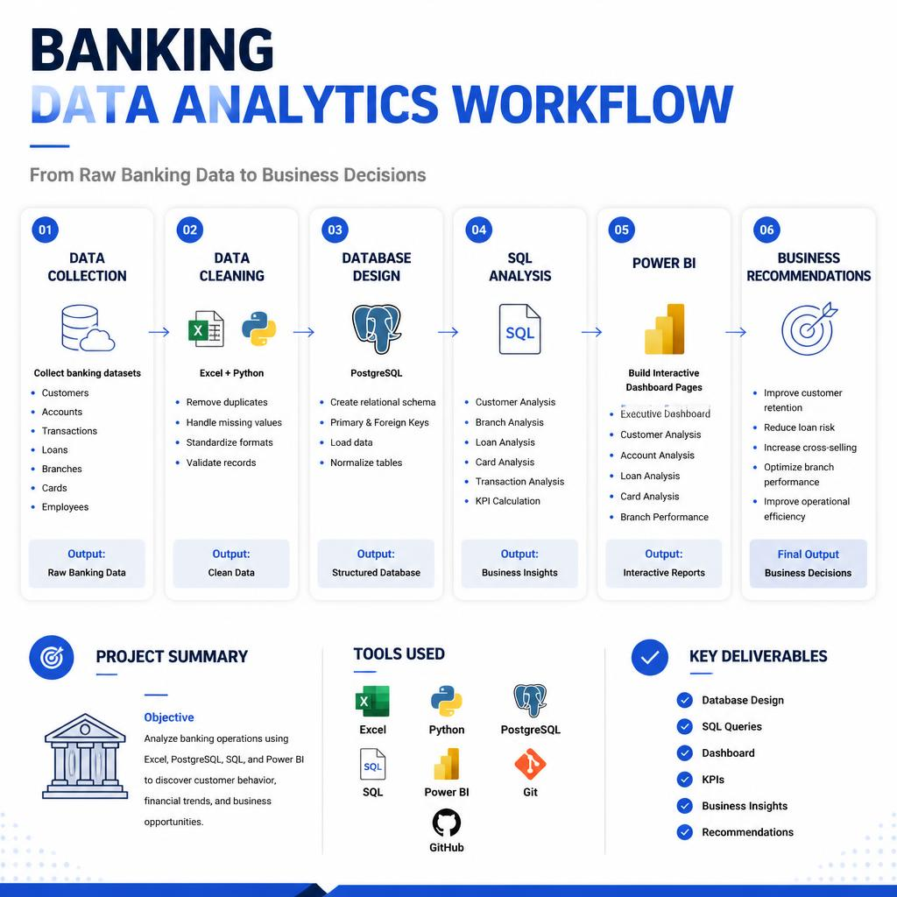

## 🏦 Banking Data Analysis — Risk, Fraud & Branch Performance

Analyzing deposits, loans, cards, and customer support for a synthetic retail bank ("PrimeBank" in the dashboard) to surface credit risk, fraud exposure, and branch performance using SQL, Power BI, and Excel.

### 📌 Table of Contents

- [Overview](#overview)
- [Objective](#objective)
- [Dataset](#dataset)
- [Tools & Technologies](#tools--technologies)
- [Project Structure](#project-structure)
- [Database Design](#database-design)
- [SQL Analysis](#sql-analysis)
- [Key Findings](#key-findings)
- [Sechma](#sechma)
- [Dashboard](#dashboard)
- [Project Workflow](#project-workflow)
- [Business Recommendations](#business-recommendations)
- [Data Notes & Challenges](#data-notes--challenges)
- [How to Run This Project](#how-to-run-this-project)
- [Author & Contact](#author--contact)

### Overview

This project builds an analytics pipeline over a 10-table relational banking dataset — branches, employees, customers, accounts, loans, loan payments, cards, card transactions, transactions, and support tickets. A normalized PostgreSQL schema was designed with primary/foreign keys and performance indexes, 40+ business questions were answered across ten SQL scripts, and the results were turned into an 8-page Power BI dashboard covering everything from executive KPIs to fraud and risk. `Project Report.docx` has the full write-up — methodology, dashboard walkthrough, and business recommendations — if you want the long-form version of what's summarized here.

### Objective

Retail banks generate high-volume data across customers, accounts, loans, cards, and transactions — data that directly shapes credit risk, fraud exposure, and branch profitability. The goal here is to answer the questions a bank's management team actually needs answered: where is deposit and loan growth coming from, which branches and customers carry the most risk, and where is fraud concentrated — then hand those answers to the right audience (executives, branch managers, risk officers, support leads) through one dashboard.

### Dataset

Source: a synthetic, relational **BankCorp** dataset (documented in `Data/README.md`), sized to support a full SQL + Power BI + Excel workflow.

**Size:** ~304 MB | **Tables:** 10 | **Total rows:** ~5.9 million (tracked via Git LFS)

| Table | Rows | Description |
|---|---|---|
| branches | 150 | Bank branch locations |
| employees | 1,800 | Staff, roles, salaries, branch assignment |
| customers | 60,000 | Demographics, income, credit score |
| accounts | 95,000 | Savings / current / salary / FD / NRI accounts per customer |
| loans | 22,000 | Home / personal / auto / education / business / gold loans |
| loan_payments | 600,000 | EMI payment history per loan |
| cards | 65,000 | Debit / credit cards per customer |
| card_transactions | 3,000,000 | Card-level spend, includes fraud flag |
| transactions | 2,000,000 | Account-level deposits / withdrawals / transfers |
| support_tickets | 25,000 | Customer service complaints & resolutions |

### Tools & Technologies

- **PostgreSQL** — relational schema design, indexing, business-question SQL
- **SQL** — joins, aggregation, subqueries, window functions (`RANK`)
- **Power BI** — 8-page interactive dashboard
- **Excel** — supplementary pivot-style workbook (`Bank.xlsx`)
- **GitHub / Git LFS** — version control and large-file storage for the dataset

### Project Structure

```
Banking_data_analysis/
│
├── Data/                        # 10 banking tables (Git LFS) + dataset README
│   ├── branches.csv
│   ├── employees.csv
│   ├── customers.csv
│   ├── accounts.csv
│   ├── loans.csv
│   ├── loan_payments.csv
│   ├── cards.csv
│   ├── card_transactions.csv
│   ├── transactions.csv
│   ├── support_tickets.csv
│  └── README.md
│
├── Schema/
│   ├── Database_Schema.drawio      # Editable database schema
│   ├── Database_Schema.drawio.png  # Schema preview image
│   └── Database_Schema.drawio.svg  # High-quality vector diagram
│ 
├── Sql/                         # Schema + 10 business-question scripts
│   ├── Schema.sql
│   ├── 01_KPI_Analysis.sql
│   ├── 02_Customer_Analysis.sql
│   ├── 03_Branch_Performance.sql
│   ├── 04_Account_Analysis.sql
│   ├── 05_Loan_Analysis.sql
│   ├── 06_Card_Analysis.sql
│   ├── 07_Transaction_Analysis.sql
│   ├── 08_Customer_Support.sql
│   ├── 09_Risk_Analysis.sql
│   └── 10_Advanced_SQL.sql
│

├── Power bi/                    # Dashboard file + page exports
│   ├── Dashbored.pbix
│   └── 1.png ... 8.png
│
├── Excel/                       # Supplementary workbook
│   ├── Bank.xlsx
│   └── Dashbored Image.png
│
├── Project Report.docx          # Full project report
├── Summary.md                   # One-page project summary
├── README.md                    # Readme
└── Work Flow.png                # End-to-end pipeline diagram
```

### Database Design

All 10 tables were modeled in PostgreSQL (`Sql/Schema.sql`) with explicit primary keys and foreign keys tying every child table back to its parent entity.

| Table | Primary Key | Foreign Keys |
|---|---|---|
| branches | branch_id | — |
| employees | employee_id | branch_id → branches |
| customers | customer_id | — |
| accounts | account_id | customer_id → customers, branch_id → branches |
| loans | loan_id | customer_id → customers, branch_id → branches |
| loan_payments | payment_id | loan_id → loans |
| cards | card_id | customer_id → customers, account_id → accounts |
| card_transactions | card_txn_id | card_id → cards |
| transactions | transaction_id | account_id → accounts |
| support_tickets | ticket_id | customer_id → customers |

Data is bulk-loaded with PostgreSQL's `COPY` command rather than row-by-row inserts, and targeted indexes sit on the foreign keys and date columns of the three largest tables (`transactions`, `card_transactions`, `loan_payments`) to keep join-heavy, multi-million-row aggregations fast.

### SQL Analysis

40+ business questions are answered across ten scripts, ending in a window-function branch ranking:

| Script | Focus | Example question answered |
|---|---|---|
| 01_KPI_Analysis.sql | Bank-wide KPIs | Total customers, branches, loans issued, and average credit score |
| 02_Customer_Analysis.sql | Customers | Top customers by balance, sub-prime customers, income by occupation |
| 03_Branch_Performance.sql | Branches | Deposits by branch, highest loan-issuing branch |
| 04_Account_Analysis.sql | Accounts | Active account count, average balance, multi-account customers |
| 05_Loan_Analysis.sql | Loans | Loan amount and interest rate by type, late-payment rate by branch |
| 06_Card_Analysis.sql | Cards | Spend by card type, top merchant category, fraud transaction % |
| 07_Transaction_Analysis.sql | Transactions | Average transaction size, monthly volume, most-used channel |
| 08_Customer_Support.sql | Support | Average satisfaction score, resolution time, least-satisfied branches |
| 09_Risk_Analysis.sql | Risk | High-risk customers (low credit score + large loan + late-payment history) |
| 10_Advanced_SQL.sql | Advanced | Window-function branch ranking combining deposits, customers, loans, transactions |

### Key Findings

**Bank-Wide Scale**
- 60,000 customers across 150 branches, staffed by roughly 1,800–2,000 employees
- ~₹3bn in total deposits, ~₹9bn in total loan amount, and ~₹6bn in total card spending
- 95,000 accounts, 65,000 cards, 22,000 loans issued (14,000 currently active), and 25,000 support tickets logged

**Customers**
- Gender split is close to even — roughly 31K male vs. 27K female customers, plus a small "other" segment
- Average annual income sits around ₹2M with an average credit score of 600
- Annual income and credit score show no obvious relationship — high earners appear across the full credit-score range

**Branch Performance**
- Top 5 branches by deposits: Kochi Branch 2 (₹81M), Bhopal Branch 8 (₹80M), Chennai Branch 3 (₹63M), Hyderabad Branch 4 (₹62M), and Kochi Branch 1 (₹61M)
- Maharashtra alone accounts for 16.5% of total deposits, and the top 3 states make up 42.3% of deposits across all 150 branches
- Average employee salary (~₹1.03L–₹1.04L) is fairly consistent branch-to-branch, pointing to standardized pay bands rather than branch-driven differences

**Accounts & Transactions**
- 95,000 accounts — 81,000 active, 5,000 closed, average balance ~₹46K
- Savings accounts dominate by count (~48K), while NRI accounts carry the highest average balance (~₹67K)
- 2 million transactions logged, spread almost evenly across mobile app, POS, ATM, branch, UPI, and online banking

**Loans**
- ₹9bn total loan amount, 14,000 active loans, 11.51% average interest rate
- Loan book by status: Active ₹6.0bn, Closed ₹2.3bn, Defaulted ₹0.7bn, Written Off ₹0.3bn
- Late-payment rate hovers around 12% every month, and loan recovery rate sits at 71.1%

**Cards & Fraud**
- 65,000 cards issued (57,000 active), ~₹6bn total spend, ~₹2K average card spend
- Debit cards drive the bulk of spending; fraud sits at 0.50% of all card transactions — small as a share, but real in absolute terms across 3 million recorded card transactions

**Customer Support**
- 25,000 tickets — 2,987 open, 20,051 resolved, the rest escalated
- Average satisfaction score sits at 3.00 / 5 — a middling result with clear room to improve
- Ticket volume is fairly even across issue types (net banking, card blocked, fraud reports, cheque bounce, loan queries, KYC updates, and more)

**Risk Concentration**
- 21,000 customers flagged high-risk, including 14,000 likely defaulters, 15,000 fraud cases, and 18,000 customers with late-payment history
- Ahmedabad Branch 7 is the single most-flagged branch for defaults (43 cases), just ahead of Bhopal Branch 8, Kochi Branch 2, Pune Branch 1 (41 each), and Bhopal Branch 6 (40)
- Defaults skew toward Education and Gold loans (279 and 278 cases) and taper off toward Personal loans (251) — risk isn't spread evenly across loan types either

### Schema

All the files, how they are connected to each other, and which fields are the primary keys and foreign keys are defined in the following image.


### Dashboard

The Power BI dashboard (`Power bi/Dashbored.pbix`), branded **PrimeBank**, has 8 pages with consistent left-hand navigation and Year/Month filters:

**Executive Dashboard** — headline KPIs (customers, deposits, fraud %, active loans), deposits by branch, loan amount by status, accounts by status, and a monthly deposits-vs-withdrawals trend


**Customer Analysis** — demographics by gender, state, and join-year, plus income vs. credit score


**Branch Performance** — deposits by branch and state, and a full table of customers, deposits, loans, and staffing cost per branch


**Accounts & Transactions** — account health by type and status, plus transaction volume by channel and type


**Loan Analysis** — portfolio by status and loan type, interest rate, late-payment rate, and recovery rate


**Card & Fraud** — spend by card type, spend/fraud by merchant category, and the headline 0.50% fraud rate


**Customer Support** — ticket volume by issue type and status, with satisfaction score per issue type


**Risk Analysis** — defaults by branch and loan type, high-risk customer/branch counts, and a recommendations panel built directly into the page


### Excel

A supplementary Excel workbook (`Excel/Bank.xlsx`) mirrors a slice of this analysis in pivot-chart form:


### Project Workflow


### Business Recommendations

The dashboard's own Risk Analysis page carries a set of management-facing recommendations; the points below combine those with supporting recommendations from the wider SQL and dashboard analysis.

- Strengthen credit assessment for low credit-score customers before approving new loans
- Increase monitoring and follow-up for customers with repeated late payments, to catch defaults earlier
- Run a focused operational audit of Ahmedabad Branch 7 — the highest-default branch on the dashboard — alongside the other branches flagged for defaults
- Track the late-payment-rate and recovery-rate trend lines as an ongoing early-warning system, not just a point-in-time metric
- Add merchant-category-level fraud rules on top of the existing 0.50% fraud flag to target the categories driving it
- Study what the top deposit-generating branches (Kochi Branch 2, Bhopal Branch 8, Chennai Branch 3) are doing differently, and look for practices that can be replicated elsewhere
- Target service-improvement plans at the lowest-satisfaction branches and highest-volume issue types to lift the 3.00/5 baseline
- Prioritize relationship-banking and cross-sell offers for customers who already hold multiple accounts

### Data Notes & Challenges

- The dataset arrives pre-generated and already clean (see `Data/README.md`), so the main engineering effort here was schema design and load performance — not null-handling or de-duplication
- The full ~304 MB / ~5.9M-row dataset is tracked via **Git LFS** rather than committed as plain CSV, so a `git lfs pull` is needed before running anything against real data
- The original branch-ranking query (`10_Advanced_SQL.sql`) joined accounts, loans, and transactions directly, which caused row fan-out — a single account row got duplicated once per matching loan and once per matching transaction, inflating balance and count totals. Fixed by aggregating each table independently in subqueries, then combining with `LEFT JOIN`s on `branch_id` (with `COALESCE` so branches with no loans/transactions still show up as 0) before ranking with `RANK()`
- A few earlier query drafts had alias typos (`avg_interset`, `late_paymetns`) and one used `SUM()` where `AVG()` was intended — caught and corrected during review


### Author & Contact

Vivek
Data Analyst
🔗 [GitHub](https://github.com/Vivek7ok)
